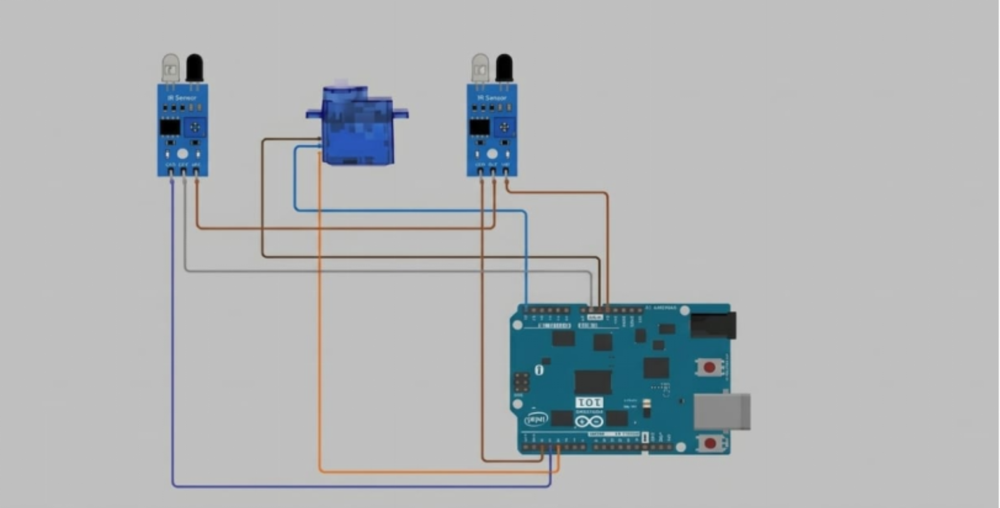
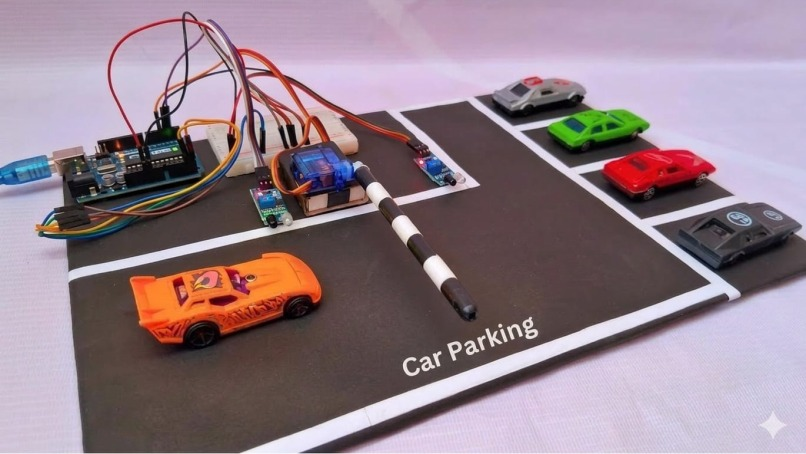

# 🚗 Smart Parking System
Smart Parking System using Arduino for real-time vehicle detection, automated gate control, and efficient parking management.


## 📌 Description

The Smart Parking System using Arduino is an innovative IoT-based project designed to solve parking problems in urban areas. It automatically detects vehicle presence in parking slots using sensors and provides real-time status updates through LED indicators and gate control.

This system reduces the time spent searching for parking, minimizes traffic congestion, and improves overall efficiency. It is a cost-effective and scalable solution that can be extended with IoT features for smart city applications.

---

## 🎯 Features

* 🚘 Automatic vehicle detection using IR sensors
* 💡 LED indication (Green = Available, Red = Occupied)
* 🚪 Servo motor-based automatic gate system
* 📊 Real-time parking slot count
* ⚡ Fast and efficient system response
* 🔧 Low-cost and easy to implement

---

## 🛠️ Technologies Used

* Arduino Uno
* Embedded C (Arduino Programming)
* IR Sensors
* Servo Motor
* LEDs
* Arduino IDE

---

## ⚙️ Working Principle

The system uses sensors installed in each parking slot to detect the presence of vehicles. When a car enters or exits:

* Sensors detect vehicle movement
* Arduino processes the input data
* LEDs update the slot status
* Servo motor opens/closes the gate
* Parking count is updated in real-time

This automation helps users quickly identify available parking spaces without manual effort.

---

## 📂 Project Structure

```
smart-parking-system/
│── README.md
│── smart-parking-system.pdf
│── code/
│     └── smart_parking.ino
│── images/
│     ├── circuit-diagram.png
│     ├── setup.png
```

---

## 📷 Project Images

### 🔹 Circuit Diagram



### 🔹 Experimental Setup



---

## 💻 Arduino Code (From Project Report)

```cpp
#include <Servo.h>

Servo gate;

// IR pins
const int irEntry = 2;
const int irExit = 3;

// Parking count
int carCount = 0;
const int maxSlots = 4;

// State tracking (to avoid multiple triggers)
int lastEntryState = HIGH;
int lastExitState = HIGH;

void setup() {
  pinMode(irEntry, INPUT);
  pinMode(irExit, INPUT);

  gate.attach(9);
  gate.write(0); // Gate closed

  Serial.begin(9600);
  Serial.println("Smart Parking System Started");
}

void loop() {

  int entryState = digitalRead(irEntry);
  int exitState = digitalRead(irExit);

  // ENTRY
  if (entryState == LOW && lastEntryState == HIGH) {

    if (carCount < maxSlots) {
      Serial.println("Car Entering...");

      gate.write(90); // Open gate
      delay(2500);

      gate.write(0); // Close gate
      delay(1000);

      carCount++;
      Serial.print("Cars inside: ");
      Serial.println(carCount);
    }
    else {
      Serial.println("Parking FULL");
    }
  }

  // EXIT
  if (exitState == LOW && lastExitState == HIGH) {

    Serial.println("Car Exiting...");

    gate.write(90);
    delay(2500);

    gate.write(0);
    delay(1000);

    if (carCount > 0) {
      carCount--;
    }

    Serial.print("Cars inside: ");
    Serial.println(carCount);
  }

  // Save states
  lastEntryState = entryState;
  lastExitState = exitState;

  delay(100);
}
```

---

## 📑 Documentation

📄 [Download Project Report](smart-parking-system.pdf)

---

## 🚀 Future Enhancements

* 📱 Mobile app integration
* 🌐 IoT-based remote monitoring
* ☁️ Cloud data storage
* 🧠 AI-based parking prediction
* 🏙️ Smart city deployment

---

## 🎓 Applications

* Shopping malls
* Smart cities
* Office buildings
* Residential complexes
* Public parking areas

---

## 👨‍💻 Authors

* M. Varun Tej Reddy
* M. Rohan
* M. Yashwanth
* Md. Ibrahim

---

## 📜 License

This project is for educational purposes only.
